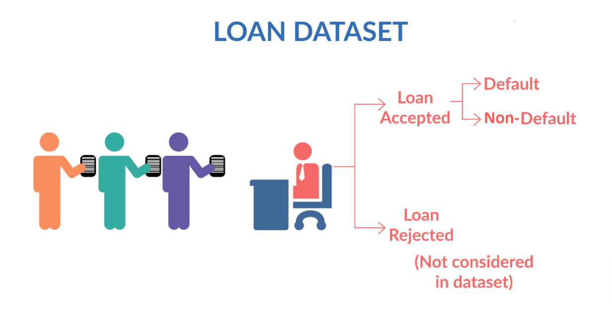

# Loan Acceptance Prediction

## Introduction

Here is my project that leverages traditional machine learning models to predict whether a loan applicant should be approved or rejected. It emphasizes data quality and usability, with proper cleaning and preprocessing to filter out irrelevant or noisy features. The project also includes exploratory data analysis (EDA) to help understand patterns, relationships, and trends in the dataset. 

## Dataset

<!-- 

    

 -->

The dataset used in this project is from [Kaggle's Loan Classification Dataset](https://www.kaggle.com/datasets/abhishek14398/loan-dataset/data) and included in the `/data` directory. It consists of customers' details for acceptance/rejection of loans. The dataset contains 2 files:
- [loan.csv](https://github.com/phuongvu0206/Loan-Acceptance-Prediction/blob/main/data/loan.csv): Contains data used to analyze and train machine learning models.
- [Data_Dictionary.xlsx](https://github.com/phuongvu0206/Loan-Acceptance-Prediction/blob/main/data/Data_Dictionary.xlsx): Contains a data dictionary containing the columns with the feature name and their respective description for loan acceptance and rejection status.

## Goals and Objectives

Feel free to explore the datasets and refer to the project documentation for a detailed description of each attribute.
